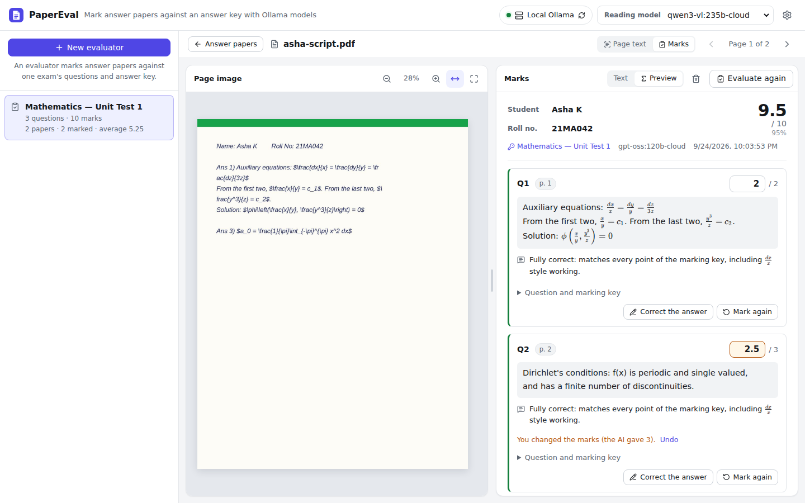
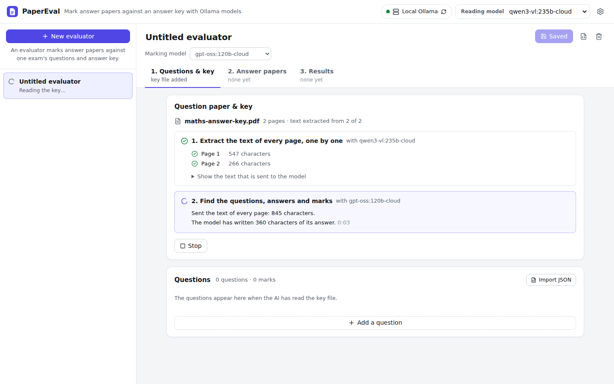
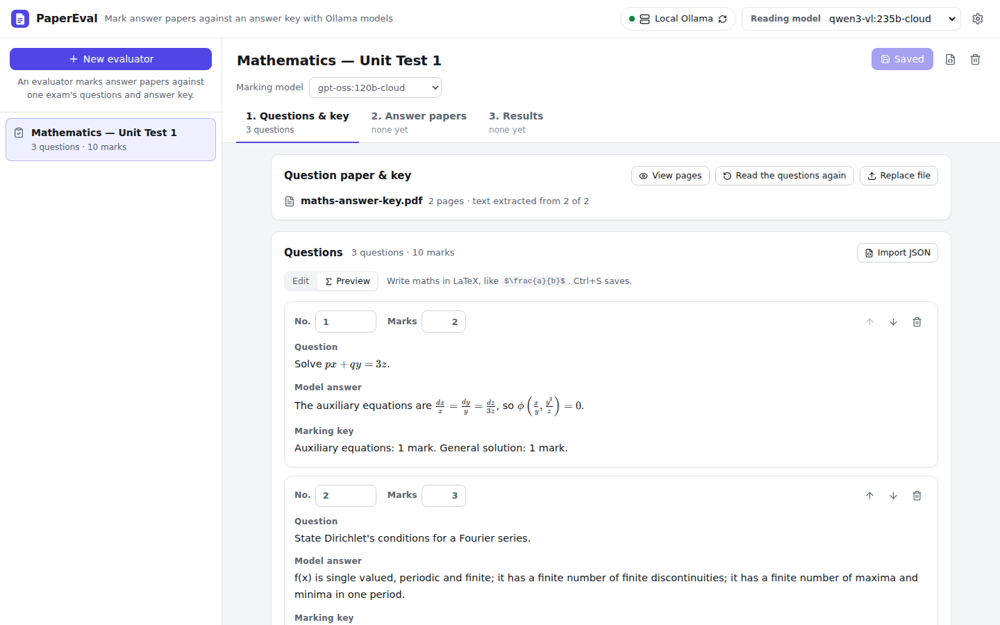
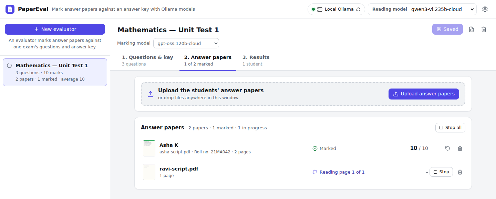
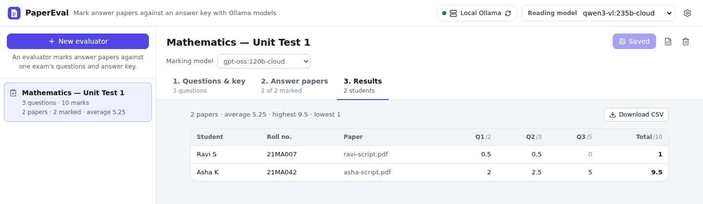

# PaperEval

Mark answer papers with AI. Create an **evaluator** for an exam and upload its question paper with the answer key:
PaperEval extracts the text of every page with an [Ollama](https://ollama.com) vision model, and an AI model lists
each question with its model answer, marking key and marks. Then upload the students' answer papers into the
evaluator. Each paper is read page by page, split into the answers to each question, and every answer is marked
against the key. You check every mark next to the student's handwriting and change any you disagree with. Works
with **Ollama Cloud** models or a local Ollama.



## Features

- **Evaluators.** One per exam. Each has its question paper with the answer key, its questions, its students'
  answer papers and their results, in three steps: **1. Questions & key**, **2. Answer papers** and **3. Results**.
- **Questions read from the key file.** Upload the question paper with its answers and marking scheme (a PDF or
  images). The text of every page is extracted, one page at a time, and then an AI model lists each question with
  its number, the question, a model answer, a marking key (which points or steps earn how many marks) and its
  marks. You see each page's progress and how much the model has written. Check and correct the questions, type
  them in yourself, or import them from a JSON file. They are stored as JSON, and you can export them.
- **Answer papers marked as they are uploaded.** Upload one PDF (or images) per student. Each paper's pages are read
  one at a time, a model splits the text into the answers to the evaluator's questions (students may answer in any
  order, across pages), and every answer is marked against its model answer and marking key, a few at a time.
  Unanswered questions get 0. Papers are done one after another, and the list shows how each is getting on.
- **Review the marks side by side.** Each answer is shown with its marks, the model's feedback and the pages it is
  on: click a page to see the student's handwriting next to it. Change any mark, correct an answer the text
  extraction got wrong and have it marked again, or fix the student's name and roll number.
- **Class results.** A table of every student's marks per question, with the average, highest and lowest totals,
  and a CSV download for Excel or Google Sheets.
- **Upload PDFs and images** (PNG, JPEG, WebP, GIF, BMP, TIFF) by picking them or dropping them anywhere on the page.
  PDFs are split into one image per page, and multi-page TIFFs into one image per frame. Phone photos are turned
  upright using their EXIF orientation.
- **Every page's text.** Open a paper (or the key file) to see each page's extracted text. **Re-run** reads a page
  again, for example with another model. The text streams in as the model writes it, and you can stop a run at any
  time. Pages are read one at a time.
- **Side-by-side comparison.** The page image is on the left (fit width or page, zoom with the buttons or
  Ctrl/⌘ + scroll, drag to pan). The text is on the right (copy, download as `.txt`, monospace toggle).
  Drag the divider between them to resize.
- **Maths preview.** Switch the text panel from **Text** to **Preview** to see the answer formatted, with its LaTeX
  maths typeset (`$...$`, `$$...$$`, `\(...\)` and `\[...\]`). Copy and download still give the LaTeX source.
- **Ollama Cloud or local.** The model lists come from the server, and you can add any other model by name.
  The list at the top, which chooses the model that reads pages, hides models that can't read images. Thinking
  models have their reasoning turned off so they answer straight away.
- **Everything is kept.** Evaluators, pages, extracted text and marks are saved on disk, so they are still there
  after a restart.
- **Choose the prompt.** Use the *Plain text*, *Markdown* or *Maths (LaTeX)* preset, or write your own in Settings.
  *Maths (LaTeX)* asks the model to write every formula in LaTeX, which suits the preview.


## How it works

```
React (Vite) ──/api──▶ FastAPI backend ──▶ Ollama Cloud (https://ollama.com) or a local Ollama
                        ├─ splits PDFs with PDFium and images with Pillow
                        ├─ reads each page with a vision model (OCR)
                        ├─ reads the questions from a key file, splits each answer paper's text into
                        │  answers and marks them, asking the model for JSON
                        ├─ stores evaluators, pages, text and marks in backend/data/
                        └─ streams progress back as NDJSON
```

The browser never talks to Ollama directly, so your API key stays on the server.

## Requirements

- Python 3.10 or newer
- Node.js 20.19+ or 22.12+
- Either an Ollama account with an API key (for Ollama Cloud) or Ollama installed locally

## Quick start with Ollama Cloud

1. **Create an API key** at <https://ollama.com/settings/keys>.

2. **Start the backend:**

   ```bash
   cd backend
   python -m venv .venv
   source .venv/bin/activate          # Windows: .venv\Scripts\activate
   pip install -r requirements.txt
   cp .env.example .env               # then put your key in .env: OLLAMA_API_KEY=...
   python -m app
   ```

   The backend reads `backend/.env` when it starts. It runs on <http://localhost:8710>, its API docs are at
   <http://localhost:8710/docs>, and it restarts by itself when its code changes, for example after a `git pull`.
   When it starts, it prints which Ollama it uses: `Using Ollama Cloud at https://ollama.com (with an API key)`
   means your key was found. (`uvicorn app.main:app --reload --port 8710` works too.)

3. **Start the frontend** in a second terminal:

   ```bash
   cd frontend
   npm ci
   npm run dev
   ```

   `npm ci` installs exactly the versions listed in `package-lock.json` and never changes that file, so later
   `git pull`s aren't blocked by local changes to it.

4. Open <http://localhost:5710>, choose the reading model at the top (a vision model, for example
   `qwen3-vl:235b`) and press **New evaluator**. See [Marking answer papers](#marking-answer-papers).

### Ports

The backend listens on port **8710** and the frontend's dev server on port **5710**, which forwards `/api` requests
to the backend. If another program already uses one of them, choose others in `backend/.env` and restart both:

```
BACKEND_PORT=8720
FRONTEND_PORT=5720
```

The frontend's dev server reads `backend/.env` too, so it always knows where the backend is.

### Two ways to use cloud models

| | Ollama Cloud API | Local Ollama, signed in |
|---|---|---|
| Setup | Set `OLLAMA_API_KEY` | Run `ollama signin` |
| `OLLAMA_BASE_URL` | `https://ollama.com` (the default when a key is set) | `http://localhost:11434` (the default) |
| Model names | as listed by ollama.com, e.g. `qwen3-vl:235b` | with a `-cloud` suffix, e.g. `qwen3-vl:235b-cloud` |

Both work without code changes. The backend can also use ordinary local models, such as `ollama pull qwen2.5vl`.

### Adding models to the list

The model list shows the vision models your Ollama server reports. To use a model that isn't listed:

- **In the app:** choose **+ Add a model…** at the bottom of the model list (or open **Settings → Models**), type the
  model's exact name and press **Add**. It is selected right away and saved in your browser. Remove it from the same
  place in Settings.
- **As the default for everyone:** set `OLLAMA_MODEL` in `backend/.env`. It always appears in the list and is used
  until someone picks another model.
- **With a local Ollama:** `ollama pull <model>` (for example `ollama pull qwen3-vl:235b-cloud`) makes it appear in
  the list by itself.

With an API key the app talks to ollama.com directly, where cloud models are named without the `-cloud` suffix
that ollama.com shows (for example `qwen3-vl:235b` rather than `qwen3-vl:235b-cloud`). The app removes that
suffix for you, so either name works. A model you choose is always tried, even if the server's information says it
cannot read images.

For example, Gemma 4 on Ollama Cloud is `gemma4:31b-cloud` (`gemma4:31b` on the API). Names such as `gemma4`,
`gemma4:latest` or `gemma4:cloud` don't exist there. When a model isn't found, the error suggests similar names
that the server does offer.

## Marking answer papers

Choose the **Reading model** at the top: the vision model that extracts the text of the pages, for example
`qwen3-vl:235b-cloud`. For maths papers, choose the *Maths (LaTeX)* prompt in Settings.

1. **Create an evaluator.** Press **New evaluator**, and choose its **Marking model**: the model that reads the
   questions from the key file, splits the answer papers into answers and marks them.
2. **Upload the question paper with its answer key** in step 1, **Questions & key**. The text of every page is
   extracted, one page at a time, and then all of it goes to the marking model, which lists each question with its
   answer, marking key and marks. You see each page's progress and how much the model has written. If the model
   finds no questions, you see what it answered and the text it was sent, and can try again, for example with
   another model.

   

   Check the questions it read, and set any marks it missed: every question needs its marks before papers can be
   marked. Write maths in LaTeX (`$\frac{a}{b}$`); **Preview** shows it typeset. Press **Save changes** (or
   Ctrl+S). You can also type the questions in, or **Import JSON** in the [answer key format](#answer-key-format).

   
3. **Upload the answer papers** in step 2, **Answer papers**: one PDF (or images of the pages) per student. Pick
   them, or drop them anywhere on the window. Each paper is marked against the evaluator's questions as soon as it
   is uploaded: its pages are read, the text is split into answers, and each answer is marked. The list shows each
   paper's progress and its marks. **Evaluate all** marks any papers that are not marked yet, for example ones
   uploaded before the questions were ready.

   
4. **Check the marks.** Click a paper to see its pages next to its marks. Each answer shows its marks, the model's
   feedback and its pages; click a page to see it on the left. Type another number to change a mark (**Undo** goes
   back to the AI's), **Correct the answer** when the text was read wrong (it is then marked again), or **Mark
   again** to have it re-marked. **Question and marking key** shows what the answer was marked against. Marks
   changed by you count instead of the AI's in the totals.
5. **Get the results** in step 3, **Results**: every student's marks per question. **Download CSV** saves them with
   the totals and each student's name and roll number.

   

If marking is stopped part way (or a model fails), the answers marked so far are kept, and **Finish** marks the
rest. Evaluating a paper again replaces its marks, including ones you changed. Deleting an evaluator deletes its
key file, its answer papers and their marks.

**Which models?** Reading the pages needs a vision model. Reading the questions, splitting and marking work on
text, so any model can do them; a large model follows the marking key best, for example `gpt-oss:120b` or
`qwen3.5:397b` on Ollama Cloud. AI marks are suggestions: check them before you use them.

### Answer key format

An evaluator's questions are saved in `backend/data/exams/<id>.json`, and **Export** (the JSON button next to
**Save**) and **Import JSON** use this format:

```json
{
  "name": "Mathematics — Unit Test 1",
  "questions": [
    {
      "number": "1",
      "question": "Solve $px + qy = 3z$.",
      "answer": "The auxiliary equations are $\\frac{dx}{x} = \\frac{dy}{y} = \\frac{dz}{3z}$, so $\\phi(x/y, y^3/z) = 0$.",
      "key": "Auxiliary equations: 1 mark. General solution: 1 mark.",
      "max_marks": 2
    }
  ]
}
```

`key` is the marking scheme: which points or steps earn how many marks. Import also accepts a plain list of
questions, and `marks`, `model_answer` or `marking_scheme` as field names.

## Updating

```bash
git pull
cd frontend
npm ci                                  # only needed when package.json changed
cd ../backend
pip install -r requirements.txt         # only needed when requirements.txt changed
```

Stop `npm run dev` before running `npm ci`: on Windows, the running dev server keeps files open and the reinstall
fails. Restart the backend after pulling. Answer papers you marked with an earlier version, which had no
evaluators, are put into the evaluator of the answer key they were marked against when the backend starts. Other
uploads can be added to an evaluator with **Or use a file you uploaded earlier**. If `git pull` says your local changes to `frontend/package-lock.json` would be overwritten, an earlier
`npm install` rewrote that file. Discard the change with `git restore frontend/package-lock.json` and pull again.

## Running as a single server

Build the frontend once. When `frontend/dist` exists, the backend serves the app itself:

```bash
cd frontend && npm run build
cd ../backend && python -m app --no-reload
```

Then open <http://localhost:8710>. To reach it from other machines, add `--host 0.0.0.0` (or set
`BACKEND_HOST=0.0.0.0`).

## Configuration

Set these in `backend/.env` or as environment variables (which take precedence). Restart the backend after
changing them.

| Variable | Default | Description |
|---|---|---|
| `BACKEND_PORT` | `8710` | Port the backend listens on (`python -m app`). |
| `FRONTEND_PORT` | `5710` | Port of the frontend's dev server (`npm run dev`). |
| `BACKEND_HOST` | `127.0.0.1` | Address the backend listens on. `0.0.0.0` makes it reachable from other machines. |
| `OLLAMA_API_KEY` | | API key for Ollama Cloud, sent as a Bearer token. |
| `OLLAMA_BASE_URL` | `https://ollama.com` if a key is set, otherwise `http://localhost:11434` | The Ollama server to use. |
| `OLLAMA_MODEL` | | Model to use when none is chosen in the UI. |
| `OLLAMA_TIMEOUT` | `600` | Seconds to wait for Ollama to send the next part of a response. |
| `OLLAMA_NUM_CTX` | `0` | Context window to request from a local model. `0` leaves it to the server. |
| `OCR_MAX_IMAGE_SIDE` | `2048` | Pages are scaled down to this many pixels on their longest side before they are sent to the model. `0` sends them at full size. |
| `PDF_DPI` | `200` | Resolution for rendering PDF pages. |
| `MAX_UPLOAD_MB` | `50` | Largest file you can upload. |
| `MAX_PAGES` | `200` | Most pages a single upload can have. |
| `GRADING_CONCURRENCY` | `3` | How many answers of a paper are marked at the same time. Lower it if Ollama reports rate limits. |
| `DATA_DIR` | `backend/data` | Where documents, answer keys and marks are stored. |
| `FRONTEND_DIST` | `frontend/dist` | The frontend build to serve, if it exists. |

## API

| Method | Path | Description |
|---|---|---|
| `GET` | `/api/ollama` | Connection status and available models, marked with whether they can read images |
| `GET` | `/api/config` | Default model, prompt presets and upload limits |
| `POST` | `/api/documents` | Upload a PDF or image (multipart field `file`) and split it into pages. Add the form fields `exam_id` and `role` (`key` or `script`) to upload it into an evaluator |
| `GET` | `/api/documents` | All documents, newest first, each with the evaluator (`exam_id`) and `role` it has |
| `GET` | `/api/documents/{id}` | One document, including its pages and their results |
| `PATCH` | `/api/documents/{id}` | Move a document into an evaluator; body `{"exam_id": "...", "role": "key"}`, or nulls to take it out |
| `DELETE` | `/api/documents/{id}` | Delete a document |
| `GET` | `/api/documents/{id}/pages/{n}/image` | Page image; `/thumbnail` gives a small preview |
| `POST` | `/api/documents/{id}/pages/{n}/ocr` | Extract a page's text; body `{"model": "...", "prompt": "..."}`, both optional |

The OCR endpoint streams [NDJSON](https://github.com/ndjson/ndjson-spec) events:

```
{"type": "start", "model": "qwen3-vl:235b"}
{"type": "thinking"}
{"type": "chunk", "text": "PHYSICS 101 — "}
{"type": "done", "result": {"text": "...", "model": "...", "duration_ms": 4300, "truncated": false, ...}}
{"type": "error", "message": "Ollama refused the request (HTTP 401: unauthorized). Check that OLLAMA_API_KEY ..."}
```

`thinking` is only sent if the model reasons before answering. A run ends with either `done` or `error`.
Closing the connection stops the model.

Evaluators (called exams in the API) and evaluations:

| Method | Path | Description |
|---|---|---|
| `GET` | `/api/exams` | All evaluators, with their number of questions, total marks and key file |
| `POST` | `/api/exams` | Create an evaluator; body `{"name": "...", "questions": [...]}`, both optional |
| `POST` | `/api/exams/{id}/read-key` | Read the questions from the evaluator's key file, whose pages must have text; body `{"model": "..."}`. Replaces its questions. Streams NDJSON: `start`, `progress`, then `done` with the evaluator or `error` with the model's answer |
| `POST` | `/api/exams/from-document` | Create an evaluator from any document whose pages have text; body `{"document_id": "...", "model": "..."}`. Streams NDJSON like `read-key` |
| `GET` `PUT` `DELETE` | `/api/exams/{id}` | One evaluator; deleting it also deletes its key file, its answer papers and their marks |
| `GET` | `/api/exams/{id}/results.csv` | Every evaluated paper's marks, as CSV |
| `POST` | `/api/documents/{id}/evaluations` | Evaluate an answer paper; body `{"exam_id": "...", "model": "..."}`. Streams NDJSON |
| `GET` | `/api/evaluations` | Summaries of all evaluations; filter with `?document_id=` or `?exam_id=` |
| `GET` `PATCH` `DELETE` | `/api/evaluations/{id}` | One evaluation; `PATCH` corrects `student_name` or `roll_number` |
| `PATCH` | `/api/evaluations/{id}/answers/{question_id}` | Set `teacher_marks` (null goes back to the AI's) or correct the `answer` text |
| `POST` | `/api/evaluations/{id}/grade` | Mark answers again; body `{"model": "...", "question_ids": [...]}`, where no ids means every answer without marks. Streams NDJSON |

An evaluation streams these events:

```
{"type": "status", "step": "split"}
{"type": "split", "evaluation": {"student_name": "Asha K", "answers": [{"question_id": "...", "status": "pending", ...}], ...}}
{"type": "answer", "answer": {"question_id": "...", "status": "graded", "ai_marks": 2, "feedback": "...", ...}}
{"type": "done", "evaluation": {..., "marks": 7.5, "max_marks": 10, "complete": true}}
```

or an `error` event. While the paper is split, `progress` events say how much the model has written. Rate limits
and overloaded servers are retried twice; an invalid key, a model outside your plan or an unknown model stops the
evaluation, and the answers not yet marked can be marked later.

The models are asked for JSON in a set shape, but their answers are read leniently: a bare list, sections such as
Part A and Part B, sub-questions and other field names all work. An answer that can't be used is asked for once
more without a JSON schema, since some servers ignore the schema and models sometimes give up inside one.

## Development

```bash
# Backend: tests and lint
cd backend
pip install -r requirements-dev.txt
pytest
ruff check . && ruff format --check .

# Frontend: unit tests, type check and lint
cd frontend
npm test
npm run typecheck
npm run lint
```

In development, Vite sends `/api` requests to the backend at the port set in `backend/.env` (8710 by default). To
use another address, set `BACKEND_URL` when you run `npm run dev`.

## Project layout

```
backend/
  app/
    __main__.py   `python -m app`: starts the backend on the configured port
    main.py       app factory, serves the frontend build
    api.py        HTTP routes
    pages.py      splitting PDFs and images into page images
    storage.py    documents, page images and OCR results on disk
    ollama.py     Ollama / Ollama Cloud client, including JSON answers
    ocr.py        prompts and the streamed OCR run
    exams.py      evaluators (exams) and their questions on disk
    grading.py    prompts for reading answer keys, splitting scripts and marking answers
    evaluations.py  evaluations on disk and the streamed evaluation run
    grading_api.py  HTTP routes for evaluators and evaluations
    llm_json.py   reads JSON written by a model, keeping LaTeX intact
    config.py     settings from environment variables
  tests/
frontend/
  src/
    App.tsx       app state: evaluators, documents, evaluations, what is shown, models
    evaluator.ts  an evaluator's steps: reading its key file, whether papers can be marked, each paper's state
    ocrQueue.ts   runs OCR jobs one at a time and tracks their progress
    evaluationRunner.ts  runs evaluations one at a time and tracks their progress
    exams.ts      question helpers: import, export, totals
    api.ts        typed API client
    components/   evaluator list and steps, question editor, split view, image viewer, text and marks panels
```
