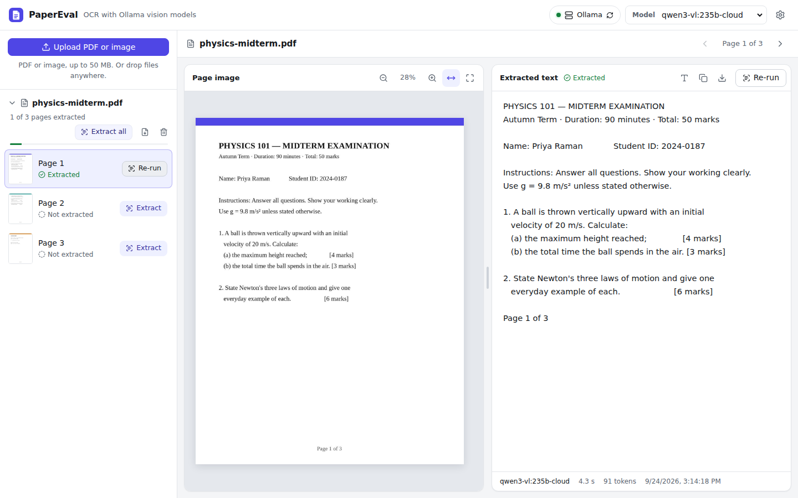

# PaperEval

Upload a PDF or an image, split it into one image per page, and extract each page's text with an
[Ollama](https://ollama.com) vision model. Works with **Ollama Cloud** models or a local Ollama.
Each page is shown next to its extracted text, so you can check the OCR against the original.



## Features

- **Upload PDFs and images** (PNG, JPEG, WebP, GIF, BMP, TIFF) by picking them or dropping them anywhere on the page.
  PDFs are split into one image per page, and multi-page TIFFs into one image per frame. Phone photos are turned
  upright using their EXIF orientation.
- **An Extract button for every page.** It sends that page image to the selected Ollama vision model. The text
  streams in as the model writes it, and you can stop a run at any time. **Extract all** queues every page that
  has no text yet. Pages are read one at a time.
- **Side-by-side comparison.** The page image is on the left (fit width or page, zoom with the buttons or
  Ctrl/⌘ + scroll, drag to pan). The text is on the right (copy, download as `.txt`, monospace toggle).
  Drag the divider between them to resize.
- **Maths preview.** Switch the text panel from **Text** to **Preview** to see the answer formatted, with its LaTeX
  maths typeset (`$...$`, `$$...$$`, `\(...\)` and `\[...\]`). Copy and download still give the LaTeX source.
- **Ollama Cloud or local.** The model list comes from the server, and you can add any other model by name.
  Models that can't read images are hidden, and thinking models have their reasoning turned off so they answer
  straight away.
- **Results are kept.** Pages and extracted text are saved on disk, so they are still there after a restart.
  You can download all of a document's text as one file.
- **Choose the prompt.** Use the *Plain text*, *Markdown* or *Maths (LaTeX)* preset, or write your own in Settings.
  *Maths (LaTeX)* asks the model to write every formula in LaTeX, which suits the preview.

## How it works

```
React (Vite) ──/api──▶ FastAPI backend ──▶ Ollama Cloud (https://ollama.com) or a local Ollama
                        ├─ splits PDFs with PDFium and images with Pillow
                        ├─ stores page images, thumbnails and results in backend/data/
                        └─ streams the model's answer back as NDJSON
```

The browser never talks to Ollama directly, so your API key stays on the server.

## Requirements

- Python 3.10 or newer
- Node.js 20.19+ or 22.12+
- Either an Ollama account with an API key (for Ollama Cloud) or Ollama installed locally

## Quick start with Ollama Cloud

1. **Create an API key** at <https://ollama.com/settings/keys>.

2. **Start the backend:**

   ```bash
   cd backend
   python -m venv .venv
   source .venv/bin/activate          # Windows: .venv\Scripts\activate
   pip install -r requirements.txt
   cp .env.example .env               # then put your key in .env: OLLAMA_API_KEY=...
   uvicorn app.main:app --reload --env-file .env
   ```

   The backend runs on <http://localhost:8000>. Its API docs are at <http://localhost:8000/docs>.

3. **Start the frontend** in a second terminal:

   ```bash
   cd frontend
   npm install
   npm run dev
   ```

4. Open <http://localhost:5173>, choose a vision model at the top (for example `qwen3-vl:235b`), upload a file,
   and press **Extract** on a page.

### Two ways to use cloud models

| | Ollama Cloud API | Local Ollama, signed in |
|---|---|---|
| Setup | Set `OLLAMA_API_KEY` | Run `ollama signin` |
| `OLLAMA_BASE_URL` | `https://ollama.com` (the default when a key is set) | `http://localhost:11434` (the default) |
| Model names | as listed by ollama.com, e.g. `qwen3-vl:235b` | with a `-cloud` suffix, e.g. `qwen3-vl:235b-cloud` |

Both work without code changes. The backend can also use ordinary local models, such as `ollama pull qwen2.5vl`.

### Adding models to the list

The model list shows the vision models your Ollama server reports. To use a model that isn't listed:

- **In the app:** choose **+ Add a model…** at the bottom of the model list (or open **Settings → Models**), type the
  model's exact name and press **Add**. It is selected right away and saved in your browser. Remove it from the same
  place in Settings.
- **As the default for everyone:** set `OLLAMA_MODEL` in `backend/.env`. It always appears in the list and is used
  until someone picks another model.
- **With a local Ollama:** `ollama pull <model>` (for example `ollama pull qwen3-vl:235b-cloud`) makes it appear in
  the list by itself.

With an API key the app talks to ollama.com directly, where cloud models are named without the `-cloud` suffix
that ollama.com shows (for example `qwen3-vl:235b` rather than `qwen3-vl:235b-cloud`). The app removes that
suffix for you, so either name works. A model you choose is always tried, even if the server's information says it
cannot read images.

## Running as a single server

Build the frontend once. When `frontend/dist` exists, the backend serves the app itself:

```bash
cd frontend && npm run build
cd ../backend && uvicorn app.main:app --env-file .env
```

Then open <http://localhost:8000>. Add `--host 0.0.0.0` to reach it from other machines.

## Configuration

Set these as environment variables or in `backend/.env`:

| Variable | Default | Description |
|---|---|---|
| `OLLAMA_API_KEY` | | API key for Ollama Cloud, sent as a Bearer token. |
| `OLLAMA_BASE_URL` | `https://ollama.com` if a key is set, otherwise `http://localhost:11434` | The Ollama server to use. |
| `OLLAMA_MODEL` | | Model to use when none is chosen in the UI. |
| `OLLAMA_TIMEOUT` | `600` | Seconds to wait for Ollama to send the next part of a response. |
| `OLLAMA_NUM_CTX` | `0` | Context window to request from a local model. `0` leaves it to the server. |
| `OCR_MAX_IMAGE_SIDE` | `2048` | Pages are scaled down to this many pixels on their longest side before they are sent to the model. `0` sends them at full size. |
| `PDF_DPI` | `200` | Resolution for rendering PDF pages. |
| `MAX_UPLOAD_MB` | `50` | Largest file you can upload. |
| `MAX_PAGES` | `200` | Most pages a single upload can have. |
| `DATA_DIR` | `backend/data` | Where documents and results are stored. |
| `FRONTEND_DIST` | `frontend/dist` | The frontend build to serve, if it exists. |

## API

| Method | Path | Description |
|---|---|---|
| `GET` | `/api/ollama` | Connection status and available models, marked with whether they can read images |
| `GET` | `/api/config` | Default model, prompt presets and upload limits |
| `POST` | `/api/documents` | Upload a PDF or image (multipart field `file`) and split it into pages |
| `GET` | `/api/documents` | All documents, newest first |
| `GET` | `/api/documents/{id}` | One document, including its pages and their results |
| `DELETE` | `/api/documents/{id}` | Delete a document |
| `GET` | `/api/documents/{id}/pages/{n}/image` | Page image; `/thumbnail` gives a small preview |
| `POST` | `/api/documents/{id}/pages/{n}/ocr` | Extract a page's text; body `{"model": "...", "prompt": "..."}`, both optional |

The OCR endpoint streams [NDJSON](https://github.com/ndjson/ndjson-spec) events:

```
{"type": "start", "model": "qwen3-vl:235b"}
{"type": "thinking"}
{"type": "chunk", "text": "PHYSICS 101 — "}
{"type": "done", "result": {"text": "...", "model": "...", "duration_ms": 4300, "truncated": false, ...}}
{"type": "error", "message": "Ollama refused the request (HTTP 401: unauthorized). Check that OLLAMA_API_KEY ..."}
```

`thinking` is only sent if the model reasons before answering. A run ends with either `done` or `error`.
Closing the connection stops the model.

## Development

```bash
# Backend: tests and lint
cd backend
pip install -r requirements-dev.txt
pytest
ruff check . && ruff format --check .

# Frontend: unit tests, type check and lint
cd frontend
npm test
npm run typecheck
npm run lint
```

In development, Vite sends `/api` requests to `http://localhost:8000`. To use another address, set
`BACKEND_URL` when you run `npm run dev`.

## Project layout

```
backend/
  app/
    main.py       app factory, serves the frontend build
    api.py        HTTP routes
    pages.py      splitting PDFs and images into page images
    storage.py    documents, page images and OCR results on disk
    ollama.py     Ollama / Ollama Cloud client
    ocr.py        prompts and the streamed OCR run
    config.py     settings from environment variables
  tests/
frontend/
  src/
    App.tsx       app state: documents, selection, model, prompt
    ocrQueue.ts   runs OCR jobs one at a time and tracks their progress
    api.ts        typed API client
    components/   sidebar, split view, image viewer, text panel, settings
```
